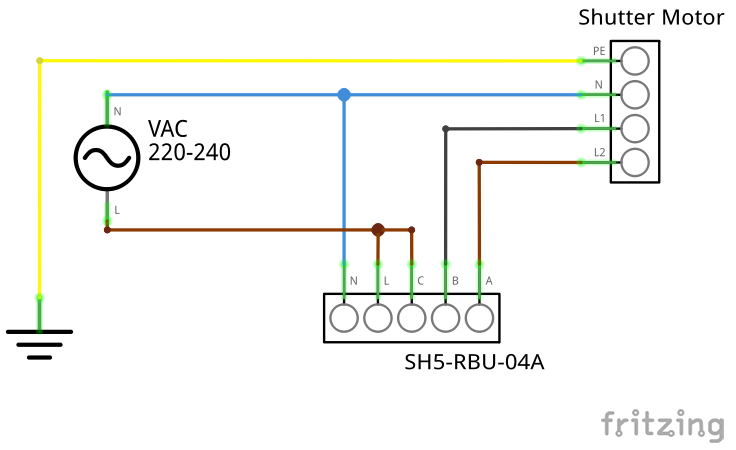

## Smartwares SH5-RBU-04A

### Introduction

The Smartwares SH5-RBU-04A power switch enables you to control your shutters by radio and has in total six memory positions for pairing with remote controls. The switch includes a SYN500R ASK receiver which works on the 433.92 MHz frequency. For instance the SH5-TDR-F remote control is compatible with the device.

In short:

Model   | SH5-RBU-04A
:-------|:------------------------
Producer|Smartwares
Frequency|433.92 MHz
Modulation scheme|ASK
Memory positions|6
Receiver chip|SYN500R

### Pairing

As mentioned before the receiver has six memory positions for being allocated. A remote control needs two of them (for UP and DOWN), which means you're able to pair three sender units. Before pairing you have to activate the pairing mode by pressing the button on the front side for about three seconds until the LED starts blinking. Now you have to press the button on your remote control which shall be mapped to the DOWN command. Afterwards you do the same with the button for the UP command. If the LED now turns off your sender unit is successfully paired with the receiver.

### Wiring

Connector   | Allocation
:-------|:------------------------
B|UP
A|DOWN
C|VAC 220-240
L|VAC 220-240
N|N

### License

This project is released under the Creative Commons Attribution v 4.0 license.

Copyright (c) 2018 Yoshua Hitzel

### Legal
This project is in no way affiliated with, authorized, maintained, sponsored or endorsed by Smartwares Safety & Lighting B.V. or any of its affiliates or subsidiaries. This is independent and unofficial. Use at your own risk.
